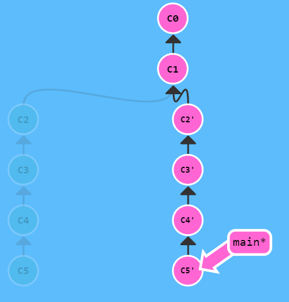

[Git parancsok vizualizációja](https://dev.to/lydiahallie/cs-visualized-useful-git-commands-37p1)

# Alapok

`git commit`

View-ban lévő változtatások commit-álása.

`git branch <branch név>`

Új branch létrehozása, ami az aktuális commit-ra mutat. A pointer nem vált automatikusan az új branch-re.

`git checkout <branch név>`

A pointer mozgatása az új branch-re.

`git checkout -b <branch név>`

Új branch létrehozása és a pointer mozgatása. Ekvivalens az előző 2 parancs lefuttatásával.

`git merge <branch név>`

Megadott branch merge-ölése arra a branch-re, amire a pointer mutat.

`git rebase <branch név>`

A pointer által kijelölt branch összes commit-jának másolása a megadott branch-re.

# A pointer mozgatása

> **HEAD**: Speciális pointer, ami az éppen kicsekkolt (legfrissebb) commit-ra mutat. Alapesetben a HEAD egy branch-re referál. A branch is egy pointer-nek tekinthető.

> **HEAD detach**: HEAD leválasztása az aktuális branch-ről, hogy egy commit-ra mutasson.

`git checkout <commit hash>`

HEAD detach elérése úgy, hogy a pointer-t a megadott commit-ra mozgatjuk.

`git checkout <pointer>^`

HEAD mozgatása a megadott pointer szülőjére.

`git checkout <pointer>~<lépésszám>`

HEAD mozgatása a megadott pointer lépésszámmal definiált ősére. Pl. `git checkout main~3`, a HEAD mozgatás a main 3-ik ősére.

`git branch -f <branch> <branch/relatív pointer/commit hash>`

Branch pointer mozgatása a megadott pozícióhoz.

`git reset <branch/relatív pointer/commit hash>`

Kicsekkolt branch pointer visszahúzása a megadott pozícióra. A parancs lefutása után a megadott pozíció utáni commit-ok töröltnek tekinthetők. Remote repository használata során ne használjuk ezt a parancsot.

`git revert HEAD`

A HEAD által kijelölt commit törlése úgy, hogy létrehoz egy olyan új commit-ot, ami a legutolsó commit törlését tartalmazza. Remote repository használata során ezzel töröljünk.

# Egyéb merge technikák

`git cherry-pick <commit hash #1> <commit hash #2> ...`

A megadott commit-ok másolása a HEAD alá.

`git rebase -i <melyik commit-tól induljon a rebase>`

Egy interaktív ablakban megadjuk, hogy a megadott commit alatt lévő commit-ok közül melyeket másoljuk a megadott commit alá egy új ágba. Ezután a régi ág törlésre kerül.

Pl. `git rebase -i HEAD~4`

