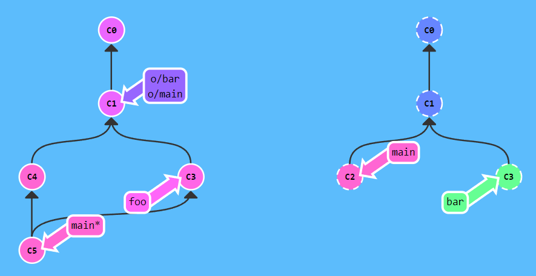

[**Git parancsok vizualizációja**](https://dev.to/lydiahallie/cs-visualized-useful-git-commands-37p1)

# Alapok

`git commit`

Staged-ben lévő változtatások commit-álása.

`git branch <branch név>`

Új branch létrehozása, ami az aktuális commit-ra mutat. A pointer nem vált automatikusan az új branch-re.

`git checkout <branch név>`

A pointer mozgatása az új branch-re.

`git checkout -b <branch név>`

Új branch létrehozása és a pointer mozgatása. Ekvivalens az előző 2 parancs lefuttatásával.

`git merge <branch név>`

Megadott branch merge-ölése arra a branch-re, amire ki van csekkolva. A kicsekkolt branch pointer-je a merge commit-ra lép.

`git rebase <cél branch>`

A pointer által kijelölt branch összes commit-jának másolása a megadott branch-re. A másolt branch pointer-je is átkerül az utolsó commit-hoz.

Alternatív használat: `git rebase <cél branch> <másolandó branch>` -> Így nem kell kicsekkolni azt a branch-et, amit másolni szeretnénk.

`git log --all --decorate --oneline --graph`

Összes branch gráfjellegű history-ja. Ha nem fér ki a konzolra az összes bejegyzés, akkor nyillal lehet navigálni és Q-val kilépni.

# A pointer mozgatása

> **HEAD**: Speciális pointer, ami az éppen kicsekkolt (legfrissebb) commit-ra mutat. Alapesetben a HEAD egy branch-re referál. A branch is egy pointer-nek tekinthető.

> **HEAD detach**: HEAD leválasztása az aktuális branch-ről, hogy egy commit-ra mutasson.

`git checkout <commit hash>`

HEAD detach elérése úgy, hogy a pointer-t a megadott commit-ra mozgatjuk.

`git checkout <pointer>^`

HEAD mozgatása a megadott pointer szülőjére.

`git checkout <pointer>~<lépésszám>`

HEAD mozgatása a megadott pointer lépésszámmal definiált ősére. Pl. `git checkout main~3`, a HEAD mozgatás a `main` 3-ik ősére.

`git branch -f <branch> <branch/relatív pointer/commit hash>`

Branch pointer mozgatása a megadott pozícióhoz.

`git revert HEAD`

A HEAD által kijelölt commit törlése úgy, hogy létrehoz egy olyan új commit-ot, ami a kijelölt commit tartalmának törlését tartalmazza. Remote repository használata során ezzel töröljünk.

`git reset <branch/relatív pointer/commit hash>`

Kicsekkolt branch pointer visszahúzása a megadott pozícióra. A parancs lefutása után a megadott pozíció utáni commit-ok töröltnek tekinthetők. Remote repository használata során ne használjuk ezt a parancsot.

**Reset típusai**

`git reset --soft <refspec>` -> A törölt commit-ok változtatásai staged állapotba kerülnek. 

> **Squash:** A resetelt commit-ok tartalmát változatlanul újra commit-oljuk.

`git reset --hard <refspec>` -> A törölt commit-ok változtatásai törlésre kerülnek.

`git reset --mixed <refspec>` -> A törölt commit-ok változtatásai unstaged állapotba kerülnek.

`git reflog`

Kilistázza a repón végrehajtott git utasításokat a következő formában:

`<rövidített commit hash> HEAD@{<sorszám>}: <rövid parancs leírás>`

Annak a commit-nak a rövidített hashkódja látható a sor elején, amelyik az adott git parancs hatására jött létre.

A sorszámozás 0-tól indul, a HEAD-é a nulla.

Példa parancsleírásra:

- `commit(merge)`
- `commit`
- `reset moving to head~1`
- `commit(initial)`
- stb.

Ebből könnyen láthatjuk hogy pl. mikor adtunk ki merge parancsot, és van lehetőségünk a merge elé resetelni a következő módon: `git reset HEAD@{1}`, ahol a `HEAD@{1}` a merge előtti utolsó commit.

# Merge technikák

`git cherry-pick <commit hash #1> <commit hash #2> ...`

A megadott commit-ok másolása a HEAD alá egy új ágba. A commit-ok nem lehetnek a HEAD ősei.

A HEAD alá a megadott sorrendben fognak a cherry-pick-elt commit-ok kerülni. Így ez a parancs ugyanúgy tud sorrendet megadni, mint az interaktív rebase.

`git rebase -i <melyik commit-tól induljon a rebase>`

Egy interaktív ablakban megadjuk, hogy a megadott commit és a HEAD között lévő commit-ok közül melyeket másoljuk a megadott commit alá egy új ágba.

Az interaktív ablakban további szerkesztési lehetőségeink vannak (pl. milyen sorrendben legyenek a commit-ok bemásolva az új ágba).

Pl. `git rebase -i HEAD~4`

`git commit --amend`

Az utolsó commit címének vagy tartalmának megváltoztatása. 

Előfordulhat, hogy nem az utolsó commit-ot szeretnénk módosítani. Ekkor interaktív rebase-el vagy cherry-pick-el módosíthatjuk a commit-ok sorrendjét úgy, hogy a frissítendő commit legyen az utolsó.

Alternatív megoldás az, hogy kicsekkoljuk a módosítandó commit-ot és `amend`-el módosítjuk. Ezután a `main`-ről cherry-pick-elhetjük a nekünk kellő commit-okat.

`git tag <label> <commit hash>`

A megadott commit-hoz egy label (pl. v1.0) fűzése. Ha a commit hash-t elhagyjuk, akkor a HEAD-hez fűzi a label-t.

`git describe <branch/relatív pointer/commit hash>`

A megadott pointer ősei között melyik tag van legközelebb és hány commit-ra van tőle.

pl. `git describe main` -> output: `v1_2_gC2` -> a `v1` tag van legközelebb, 2 commit-ra van, a `main` a C2 hash-el rendelkező commit-ra mutat.

`git checkout HEAD~^2~2`

Pointer mozgató utasítások láncolása:

- `HEAD~`: a HEAD parent-je, ami egy merge commit, tehát 2 parent-je van
- `^2`: a 2. parent
- `~2`: 2 generációt felfelé ugrás

# Remote repository kezelése

`git clone <repository URL>`

Repository letöltése.

> **Remote branch**: Mutatja, hogy a legutolsó szinkronizáláskor hol volt a remote repository egy adott branch-e, így láthatjuk, hogy hol tartunk a repository-hoz képest. Elnevezési konvenció: `<repository név>/<branch>`. A repository neve általában *origin*. Ha kicsekkoljuk a remote branch-et, akkor *detached HEAD* állapotba kerülünk, tehát a következő commit-jainkat nem fogja követni a branch pointer. A git ezzel jelzi, hogy nem lokális branch-re hivatkoztunk.

`git fetch`

Letölti azokat a commit-okat, melyek fent vannak a remote repóban, de nincsenek lokális repóban. Ezenkívül a remote branch pointer-t is frissíti, a lokális branch pointer-t nem módosítja.

`git pull`

Fetch végrehajtása, majd a letöltött commit-ok merge-ölése az aktuális branch-re.

`git push`

Lokális commit-ok publikálása a remote repón.

`git push <remote repo név> <publikálandó lokális branch>`

Külön megadhatjuk, hogy melyik branch-et melyik remote repóra akarjuk publikálni.

Ez a parancs struktúra a másik irányba, tehát fetch-nél is működik.

`git push <remote repo név> <lokális refspec/source>:<remote repó branch/target>`

A lokális refspec-el akár egy commit-ot is kijelölhetünk, amit tetszőleges remote branch alá publikálhatunk.

Ez a parancs struktúra a másik irányba, tehát fetch-nél is működik, de gyakorlatban nem használják.

Példa: `git push origin foo^:main`

A parancs akkor is működik, ha nem létező target branch-et adunk meg, mert ekkor létrehoz egy új remote (push esetén) vagy lokális branch-et (fetch esetén) és oda végzi el a publikálást.

**Üres source**

`git push origin :foo` -> *foo* remote branch törlése

`git fetch origin :bar` -> *bar* lokális branch létrehozása

**Pull használata refspec-el**

`git pull origin foo` == `git fetch origin foo; git merge o/foo`

`git pull origin bar~1:bugFix` == `git fetch origin bar~1:bugFix; git merge bugFix`

**Példa**

`git pull origin bar:foo` -> Az *origin* remote repóból töltsük le a *bar* remote branch commit-jeit. A cél a *foo* lokális branch, ami viszont még nem létezik, tehát a parancs létre fogja azt hozni. A *bar* remote branch őse (C1) megtalálható lokálisan is, tehát az alá fog kerülni a C3 commit (a C4/main-el párhuzamosan, hiszen még a *pull* parancs *fetch* szakaszában tartunk, és a *fetch* működésének alapelve, hogy a letöltött commit-ok nem módosítják a lokális fájlokat, ezért kerülnek a letöltött commit-ok külön ágra), a *foo* branch is idekerül. Ezután jön a merge, és mivel jelenleg a *main* van kicsekkolva, ezért az alá fog merge-ölődni a letöltött C3 commit.

## Publikálás eltérő history esetén

Eltérő history azt jelenti, hogy egy olyan commit után (C1), ami lokálisan és remote-ban is szerepel, más-más commit következik lokálisan és remote-ban (C3 és C2).

Megoldás rebase-el:

`git fetch; git rebase o/main; git push`

Rövidebben:

`git pull --rebase; git push`

Megoldás merge-el:

`git fetch; git merge o/main; git push`

Rövidebben:

`git pull; git push`

## Remote tracking

A *remote tracking* a kapcsolat a *main* és az *origin/main* branch-ek között. Ez miatt:

- pull esetén automatikusan a *main*-re merge-öl a remote repóból jövő változtatás
- push esetén az *origin/main*-re kerülnek a publikált commit-ok

Ez a kapcsolat repó klónozás esetén automatikusan beállítódik, de lehetőség van manuálisan is létrehozni remote track branch-et.

Példa:

`git checkout -b foo o/main; git pull`

Most már *foo* track-eli az *o/main*-t, így a fetch a *foo* pointer-t az újonnan letöltött commit-ra teszi.

A kapcsolat fordítva is működik: Ha egy a *foo* alatt lévő commit-ot publikálnánk, akkor arra a commit-ra ugrana a remote repó *main*-je és az *origin/main* is.

Ha egy már létező branch-et szeretnénk remote tracking-re állítani:

`git branch -u o/main foo`